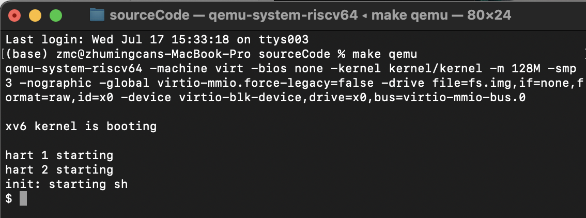
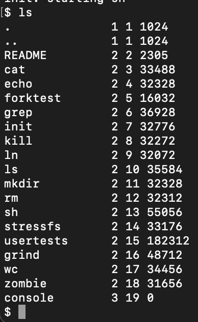
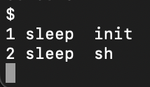
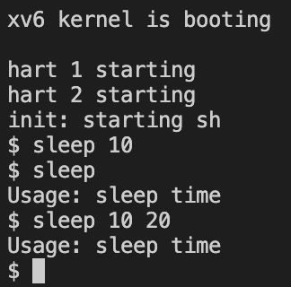
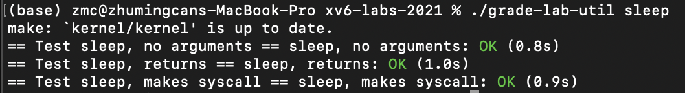
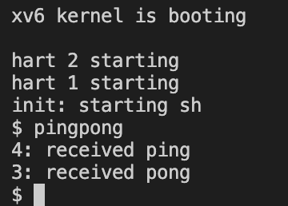
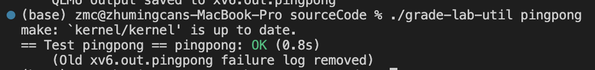
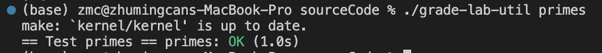
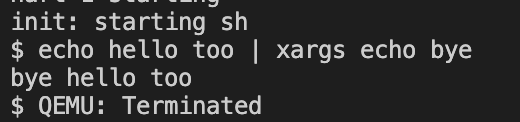
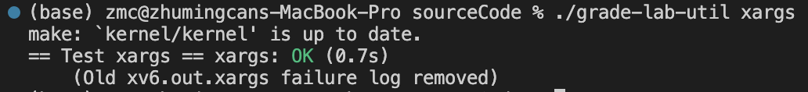

# Lab1: Xv6 and Unix utilities
> 2251920
> 朱明灿
## 环境搭建
    下载RISCV与QEMU
    $ brew tap riscv/riscv
    $ brew install riscv-tools
    $ brew install qemu
## 实验目的
- 熟悉xv6操作系统及其系统调用
- sleep：为xv6系统实现UNIX的sleep程序，并实现用户指定暂停的时钟周期数后才执行
- pingpong：使用 UNIX 系统调用编写一个程序 pingpong ，在一对管道上实现两个进程之间的通信。父进程应该通过第一个管道给子进程发送一个信息 “ping”，子进程接收父进程的信息后打印"<pid>: received ping"，其中是其进程 ID。然后子进程通过另一个管道发送一个信息 “pong” 给父进程，父进程接收子进程的信息然后打印 "<pid>: received pong" ，然后退出。
## 实验内容
- **Boot xv6**
    ```
    $ make qemu
    ```
    输出：
    
    ***
    ```
    继续输入
    $ ls
    ```
    输出：
    
    ***
    ```
    内核打印进程信息
    Ctrl-p
    ```
    输出：
    
    ***
    ```
    退出qemu
    $  Ctrl-a x
    ```
    输出：
    
    ***
- **Sleep**
    参考user目录的其他c文件，新建sleep.c文件
    核心在于接受至少一个整数参数，并将该字符串输入通过atoi转为整数，
    并调用系统函数sleep实现休眠
    ```
    详情见sourceCode/user/sleep.c
    ```
    ***
    makefile文件配置改动如下
    ```
    UPROGS=\
        ...
        ...
        ...
        $U/_sleep\
    ```
    ***
    运行```make qemu```,输出如下
    
    ***
    运行grade，输出如下
    
    ***
- **pingpong**
    按照实验提示编写pingpong.c
    通过pipe系统调用创建两个管道pipe1与pipe2，fork创建一个子进程，pipe1负责子进程读取父进程传来的“ping”并写入“pong”，pipe2负责父进程传给子进程“ping”并读取子进程传来的“pong”
    ```
    详情见sourceCode/user/pingpong.c
    ```
    同上，给makefile中加入$U/_pingpong\
    ***
    make qemu输出如下
    
    ***
    grade测试结果如下
    
    ***
- **primes**
    先编写mapping(int n, int pd[])函数，实现n到pd[n]的文件描述符重定向；
    在核心primes函数中，父进程先读取第一个数，子进程再循环读取管道中的数并将不是第一个数的倍数的数写入下一个管道，写入结束后父进程再循递归调用primes函数。
    ```
    详情见sourceCode/user/primes.c
    ```
    ***
    grade测试结果如下
    
- **xargs**
    分两种情况：
    1. 若xargs命令没有给出参数，则默认使用“echo”命令
    2. 若给出了参数，使用argv[1]作为执行命令路径并将其初始参数加入参数数组params

    接着循环读取标准输入中的每一行存入缓冲区数组，每行以"\0"和换行符为结束标志。
    读取一行后，给尾部添加尾0并加入params数组，创建子进程调用exec函数执行命令路径及其params。
    ```
    详情见sourceCode/user/xargs.c
    ```
    ***
    make qemu测试结果如下
    
    ***
    grade测试结果如下
    
## 问题的发现与解决
1. 在pingpong实验中，父进程没有使用wait函数等待子进程的写入完成，
导致还未写入时就尝试读取
2. 在xargs实验中不知道xargs命令如何获取echo提供的参数，查询资料
知道了echo将字符串输出到标准输出中并通过管道元素运算符作为标准输入给xargs
    
## 实验心得
1. 进程间可以通过管道进行信息交换，可以使用pipe函数创建管道
并把端口存放在数组中，通常0处为输入端，1处为输出端。
2. 管道是半双工的，若需要双向交流，则需要两个管道
3. fork创建子进程需要通过if(fork() == 0)编写子进程要执行的代码
4. 文件描述符是操作系统中用于标识和访问文件或其他输入/输出资源的整数值，通常是一个非负整数（0为标准输入，1为标准输出，2为标准错误）
5. 文件描述符可以进行重定向（映射），例如可以把创建的管道端口重定向到0/1，
重定向后关闭不必要的文件描述符可以节省资源
    
