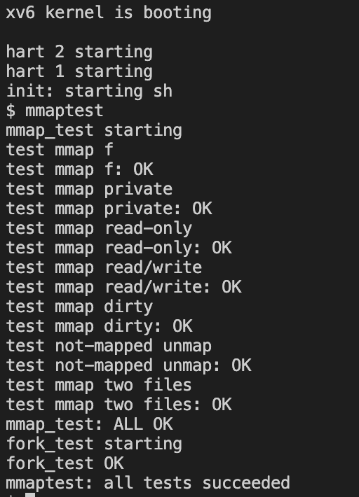
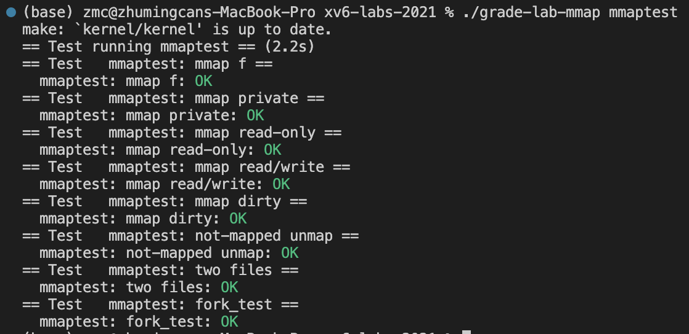

# Lab 10: mmap
> 2251920
> 朱明灿
## 环境搭建
新建lab10文件夹，重新git clone源码
git checkout mmap切换分支
## 实验目的
考虑内存映射文件的 mmap 和 munmap 系统调用，编写函数定义
## 实验内容
1. 与之前的系统调用实验一样，在不同的文件中添加一些新增系统调用必需的声明
2. 实现mmap函数。
首先在proc.h中构建 VMA 结构体数组，长度为16
接着实现mmap函数，先接收传来的参数，判断参数的合法性，然后遍历 VMA 数组，找到还没有使用的 vma，将参数信息添加进去。
3. 实现trap中断处理。
在读取或写入相应的虚拟地址时，会存在地址未映射的情况，这时需要将物理地址上的数据读到虚拟地址中，然后重新进行读取或写入操作。
产生读写中断时，需要首先判断地址是否合法。然后判断地址是否在某个文件映射的虚拟地址范围内，如果找到该文件，则读取磁盘，并将地址映射到产生中断的虚拟地址上。
4. 实现 munmap。
取消虚拟地址的映射关系，同时，设置进程 VMA 结构体相应的 vma 为未使用状态。
5. 修改fork/exit。
在进程创建和退出时，需要复制和清空相应的文件映射
6. mmaptest测试如下

grade测试如下

## 问题的发现与解决
对于是否终止mmap函数的条件没理解清楚，只对MAP_SHARED进行判断导致对只读文件尝试建立映射，查阅资料可知PROT_READ或PROT_WRITE代表了对映射区的读或写权限，而MAP_SHARED代表映射权限，因此需要同时判断MAP_SHARED和PROT_WRITE来避免对只读文件建立映射
## 实验心得
我深入理解了操作系统中内存映射文件的概念以及 mmap 和 munmap 系统调用的重要性。实现 mmap 函数的过程中，我学会了如何在操作系统中为进程建立虚拟内存映射，管理 VMA 结构体数组以及处理中断的方法。
在实验中，我遇到了对终止 mmap 函数的条件理解不清晰的问题。通过查阅相关资料和深入思考，我逐渐明白了在建立映射时需要同时考虑 MAP_SHARED 和 PROT_WRITE，以确保对文件的正确映射操作。
此外，在实验过程中，对 trap 中断的处理也让我更加熟悉了操作系统中的异常处理机制以及虚拟地址与物理地址之间的转换。这对于我理解操作系统内部机制有着重要意义。