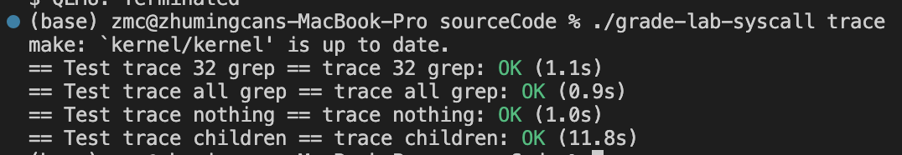

# Lab2: system calls
> 2251920
> 朱明灿
## 环境搭建
新建lab2文件夹，重新git clone源码
git checkout syscall切换分支
## 实验目的
- ### System call tracing
    在上一个实验中，我使用系统调用编写了一些实用程序。
    在本实验中，将向xv6添加一些新的系统调用，这将帮助理解它们是如何工作的，并理解熟悉xv6内核的一些内部结构，并且将在以后的实验中添加更多的系统调用。
- ### Sysinfo
    添加一个新的系统调用sysinfo，收集正在运行的进程信息并打印出来。进一步熟悉内核态与用户态的数据传递，以及xv6内核中是如何对空闲内存进行管理的。
## 实验内容
- ### System call tracing
    1. 先定义该新增系统调用的序号，在kernel/syscall.h 中新增宏定义
        ```
        #define SYS_trace  22
        ```
    2. 在user/trace.c中可知已给出了用户态的trace函数并要求为int trace(int)型。
    3. 在user/usys.pl中，该文件为提供用户态系统调用接口，添加```entry("trace");```
    4. 查询资料可知usys.pl编译后将系统调用的序号放入a7寄存器中，并通过ecall指令进入内核。ecall指令将跳转到kernel/syscall.c中的syscall函数。
    5. syscall函数从a7寄存器读取系统调用的序号，再把syscalls\[num]()的返回值放入a0寄存器，而syscalls\[num]()的执行其实就是使用系统调用，因此在其定义中新增我们的trace命令```[SYS_trace]   sys_trace```
    6. 为了调用sys_trace，在syscall.c上方新增```extern uint64 sys_trace(void);```。
    7. trace为了知道要跟踪的系统调用是哪一个，需要为kernel/proc.h中的结构体新增成员变量```int mask```，其值即为a0寄存器的值，掩码mask通常是一个二进制数，每一位代表一个系统调用号。
    8. 在 kernel/sysproc.c编写sys_trace系统调用的函数，核心是```argint(0, &mask)```（将a0寄存器值放入mask），```myproc()->mask = mask;```（将该mask赋值给当前进程的mask）。
    9. 在kernel/syscall.c中定义系统调用的名字记为syscall_names数组，如“pipe”、“wait”等，且数组第一个元素为空字符串因为系统调用的序号从1开始而不是0
    10. 在syscall函数中添加一段代码进行打印调用的信息
        ```
        if((1 << num) & p->mask) {
        printf("%d: syscall %s -> %d\n", p->pid, syscall_names[num], p->trapframe->a0);
        }
        ```
        其中(1 << num) & p->mask便是依据mask二进制位为1的地方得出调用的系统调用。最后在makefile添加$U/_trace\
    11. make qemu测试结果如下
        
        
    12. grade测试结果如下
        
        
- ### Sysinfo
    1. 首先和trace实验一样，在syscall.h中添加系统调用的序号宏定义```#define SYS_sysinfo  23```，在usys.pl中添加```entry("sysinfo");```，在syscall.c新增```[SYS_sysinfo]   sys_sysinfo,```，并给syscall_name数组末尾添加“sysinfo”
    2. 在user.h中添加sysinfo结构体和函数的声明，在syscall新增```extern uint64 sys_sysinfo(void);```
    3. 在内核proc.c中，本文件是处理进程相关的部分。proc数组是存放所有进程，每个进程有一个procstate类型成员变量state，其不为UNUSED则记录进总数。编写count_proc函数，遍历proc数组返回state不为UNUSED的进程个数即可。
    4. 在内核kalloc.c文件中，kmem变量中的freelist成员是一个空闲内存链表，编写count_free_mem函数，遍历freelist链表即可找出空闲内存块数。
    5. 在内核defs.h中存放着所有函数的声明，故新增count_proc和count_free_mem函数的声明。
    6. 在内核sysproc.c中，需要将在内核获得的信息返回给用户态，通过copyout函数可以把数据放到用户空间的寄存器中。故编写sys_sysinfo函数，核心是```copyout(p->pagetable, addr, (char *)&info, sizeof(info))```，addr是用户态的目的地址，pagetable是当前进程页表的指针，实现将info复制到addr上。
    7. 在用户空间新增sysinfo.c文件编写main函数，核心是
        ```
        struct sysinfo info;
        sysinfo(&info);
        // print the sysinfo
        printf("free space: %d\nused process: %d\n", info.freemem, info.nproc);
        ```
    8. 在makefile中添加（sysinfotest是仓库现有的测试文件）
        ```
        $U/_sysinfotest\
        $U/_sysinfo\
        ```
    9. make qemu测试结果如下
        
    10. grade测试结果如下
        
- ### make grade测试结果如下
    
## 问题的发现与解决
- ### System call tracing
1. 根据提示进程需要有一个mask成员变量，按位指明使用哪些系统调用，但编写程序时不知道如何传递这个值，查询资料得知通过将syscalls\[num]()函数返回值放入a0寄存器，内核再通过argint()函数获取该值并赋值给mask。
2. 初次尝试编写的时候发现创建子进程时出现问题，通过排查发现是没有修改内核fork函数导致的，在添加了```np->mask = p->mask;```将父进程的mask复制给子进程后解决了。
- ### Sysinfo
1. 实验要求把已经得到了想要的数据后的sysinfo变量从内核传递给用户态，已知使用copyout函数，但问题在于如何准确使用该函数传递给用户态。查询file.c中的filestat函数可知，copyout函数有四个参数，参数1为进程的页表，参数2为目的地址，参数3为要传递的数据的地址，参数4为字节大小。
故在编写sys_sysinfo函数系统调用时，p->pagetable获得页表，argaddr(0, &addr)获得目的地址（即用户态main函数中info变量的地址），内核态的info变量为要传递的数据，字节大小即为sysinfo结构体大小。


## 实验心得
- ### System call tracing
1. 在添加系统调用跟踪功能时，首先需要了解系统调用的执行流程，包括用户态和内核态之间的数据传递机制。通过在内核中设置进程的 mask 成员变量，并在系统调用中获取并使用这个值，可以实现根据掩码指示要跟踪哪些系统调用。
2. 为了确保子进程能够正确继承父进程的 mask 值，需要在 fork 函数中进行相应的处理，将父进程的 mask 值赋给子进程。
3. 打印系统调用信息时，通过按位与操作判断当前系统调用是否需要跟踪，从而只打印相关的系统调用信息，确保跟踪功能的精确性。
- ### Sysinfo
1. 在实现 sysinfo 系统调用时，需要涉及从内核态将信息传递到用户态的过程。通过了解 copyout 函数的使用，可以将内核态的数据复制到用户态指定的地址中，实现内核信息向用户空间的传递。
2. 在用户空间编写程序时，需要注意如何正确调用 sysinfo 系统调用，并正确解析内核传递的信息，以便进行后续处理和展示。