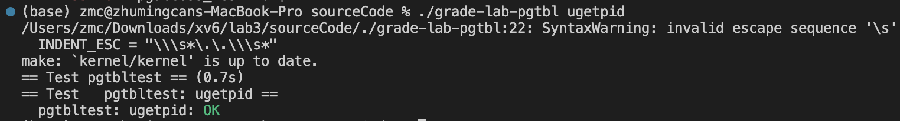
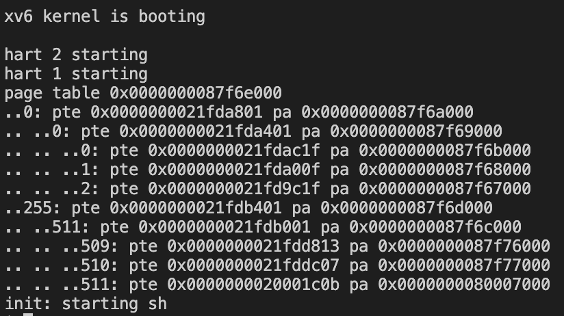
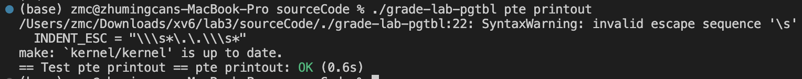
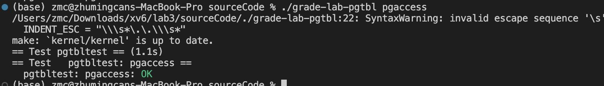

# Lab3: page tables
> 2251920
> 朱明灿
## 环境搭建
新建lab3文件夹，重新git clone源码
git checkout pgtbl切换分支
## 实验目的
- ### Speed up system calls
    加速系统调用，具体地说是在创建进程时在用户页表分配一个只读页面，这样某些系统调用可以直接从其中读取数据，无需进行内核态与用户态的切换，减少系统调用花销。
- ### Print a page table 
    定义一个名为vmprint()的函数，将第一个进程的页表按照指定格式打印出来，考察递归逻辑能力和对页表的理解。
- ### Detecting which pages have been accessed
    实现一个系统调用来检测某个页面是否被访问
## 实验内容
- ### Speed up system calls
    1. 在内核proc.c中，allocproc函数负责分配物理内存，仿照trapframe的分配方法，为usyscall分配内存，usyscall即为实验要求的只读共享空间。usyscall结构体中只有一个pid成员，添加下列代码
    ```
    if((p->usyscall) == (struct usyscall *)kalloc() == 0){
        freeproc(p);
        release(&p->lock);
        return 0;
    }
    p->usyscall->pid = p->pid;
    ```
    2. 每个进程的虚拟地址空间是独立的，因此usyscall应当是进程的一个属性，故在proc结构体定义中添加```struct usyscall *usyscall;```
    3. 上述为创建页面的步骤，接下来进行页面的释放修改。
    4. 在内核proc.c中，freeproc函数负责释放物理内存，仿照trapframe的释放方法，为usyscall释放内存，添加下列代码
    ```
    if(p->usyscall)
    kfree((void*)p->usyscall);
    p->usyscall = 0;
    ```
    5. 查询资料可知只释放物理空间仍不够，还需要调用proc_freepagetable函数解除页面的映射关系，释放进程不再需要的虚拟内存```uvmunmap(pagetable, USYSCALL, 1, 0);```
    6. 下面编写usysycall的映射实现。在proc.c中的proc_pagetable中，仿照trapframe的方法，为usyscall建立映射，代码如下
    ```
    if(mappages(pagetable, USYSCALL, PGSIZE, 
              (uint64)(p->usyscall), PTE_R | PTE_U) < 0){
      uvmunmap(pagetable, TRAMPOLINE, 1, 0);
      uvmunmap(pagetable, TRAPFRAME, 1, 0);
      uvmfree(pagetable, 0);
      return 0;
    }
    ```
    7. grade测试结果如下
    
- ### Print a page table 
    1. 在内核vm.c中，观察walkaddr函数，pagetable为512项的页表，pte指向其中某一项，PTE_V为有效位，为0代表没有映射到物理地址，PTE_U为用户权限位，为0代表没有用户权限。
    2. 编写raw_vmprint函数负责递归调用，```if((pte & PTE_V) && (pte & (PTE_R|PTE_W|PTE_X)) == 0)```判断pte是否指向低一级页表，若是，则递归```raw_vmprint((pagetable_t)child, Layer + 1);```；否则，直接打印三个“..”。其中物理地址通过PTE2PA传入pte即可获得。
    3. 编写vmprint函数，Layer传入0从第一层开始递归。
    4. 在内核def.h中添加vmprint函数声明。
    5. 在内核exec.c中添加
    ```
    if(p->pid == 1){
        printf("page table %p\n", p->pagetable);
        vmprint(p->pagetable);
    }
    ```
    6. make qemu测试结果如下
    
    7. grade测试结果如下
    
- ### Detecting which pages have been accessed
    1. 首先查阅资料，发现在pte的结构中，PTE_A位负责标记页面是否被访问，而其位于pte的第6位，故需要对每个页面的第6位进行判断。
    2. 在用户态pgtbltest.c中可以发现，本实验输入了三个参数，其中有32个页面，因此在内核riscv.h中，添加
    ```
    #define PTE_A (1L << 6)
    #define MAXSCAN 32   
    ```
    3. 在内核sysproc.c中，编写sys_pgaccess函数系统调用，核心代码是
    ```
    for(i = 0 ; i < NumberOfPages ; StartVA += PGSIZE, ++i){
        if((pte = walk(myproc()->pagetable, StartVA, 0)) == 0)
            panic("pgaccess : walk failed");
        if(*pte & PTE_A){
            BitMask |= 1 << i;	// 设置BitMask对应位
            *pte &= ~PTE_A;		// 将PTE_A清空
        }
    }
    copyout(myproc()->pagetable, BitMaskVA, (char*)&BitMask, sizeof(BitMask));
    ```
    4. NumberOfPages即输入的32，StartVA是输入的页表初始地址，walk函数获得pte物理地址，*pte & PTE_A判断该页是否被访问，并把被访问的页记录在BitMask中，再清空PTE_A，以便在下一次访问时重新检测页面是否被访问。
    5. 最后通过copyout函数将内核的BitMask复制到用户态的BitMaskVA虚拟地址处，页表负责提供映射关系。
    6. grade测试结果如下
    
## 问题的发现与解决
- ### Speed up system calls
    1.  初次尝试时产生报错信息“panic: freewalk: leaf”，查看freewalk函数，可知其会对有效的叶子页表项报错，因为freewalk函数用于释放页表结构而不是实际的页，并且官方有提示“All leaf mappings must already have been removed.”。
    解决方法：在内核proc.c的proc_freepagetable函数中，仿照前文添加```uvmunmap(pagetable, USYSCALL, 1, 0);```去移除映射关系，问题即解决
- ### Print a page table 
    1. 编写递归函数的时候发现不清楚如何获取物理地址。
    解决方法：参考vm文件下的其他函数，发现有一个宏定义```#define PTE2PA(pte) (((pte) >> 10) << 12)```用于获取物理地址，并通过查询实验手册得知了pte的结构，先右移10位代表移除低位的标志位，再左移12位是因为一个页大小为4KB，需要有12位低位作为页内偏移量，故该宏定义可以获得物理地址。
- ### Detecting which pages have been accessed
    1. 编写sys_pgaccess函数时，最后没有清空PTE_A的状态，导致测试结果报错“incorrect access bits set”，查看pgaccess_test测试函数可知，问题在于测试时多次调用了pgaccess函数去测试，每次都应当是初始状态，所以每次检查完PTE_A后需要清空恢复至初始状态。
## 实验心得
1. 通过本次实验，我深入了解了页表相关的内容，包括如何加速系统调用、打印页表以及检测页面访问情况等。这让我对操作系统内存管理的工作原理有了更深入的理解。
2. 在实验过程中，我遇到了一些问题，比如释放页面时产生了错误，或者在编写递归函数时不清楚如何获取物理地址等。通过查阅资料、阅读代码和与同学讨论，我学会了如何解决这些问题，并且提升了自己的问题解决能力。
3. 实验要求涉及到对操作系统内核的修改和扩展，这让我在操作系统开发方面有了更多的实践经验，提升了我的编程技能和对系统编程的理解。
