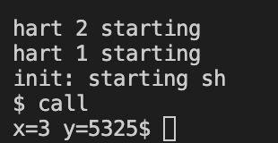

# Lab4: traps
> 2251920
> 朱明灿
## 环境搭建
新建lab4文件夹，重新git clone源码
git checkout traps切换分支
## 实验目的
- ### RISC-V assembly
    回顾和熟悉一下RISC-V汇编语言和Calling Convention，通过阅读汇编语言程序并回答一些问题
- ### Backtrace
    了解各个寄存器的相对存放位置，实现一个backtrace函数，可以打印函数调用栈，从而方便我们进行debug
- ### alarm
    添加两个系统调用sigalarm和sigreturn，实现一个进程执行时定时打断转去执行其他函数之后返回的功能
## 实验内容
- ### RISC-V assembly
    1. Q：哪些寄存器用来存放函数所用的参数？比如在main函数中调用printf时13这个参数是在哪个寄存器中传递进去的？
        A：make qemu编译代码，查看call.asm文件，可知printf函数编译后的内容。由li	a2,13知参数13存放在寄存器a2中；由li	a1,12知计算结果12存放在寄存器a1中。
    2. Q：main函数中对f函数调用的汇编代码在哪里？对g函数的调用又在哪里？
        A：在printf函数的汇编代码中，调用f函数的返回值12直接写入了代码中，即在编译阶段就计算出返回值。而f函数调用g函数是通过把g函数的汇编代码复制了一份直接写入代码中。
    3. Q：printf函数的地址是什么？
        A： 通过汇编代码```34:	5e6080e7 jalr	1510(ra)```可知，跳转到ra+0x5e6的位置执行printf函数，而ra为pc+0x0=0x30，故其地址为0x30+0x5e6=0x616。
    4. Q：在main函数中执行完跳转到printf函数的jalr指令之后，ra寄存器的值是什么？
        A：jalr指令实现跳转到ra+0x5e6的位置并将jalr下一条指令的地址存在ra中，以便跳转执行完后回到原来的下一条指令继续执行。因此，ra的值为0x34+4=0x38
    5. Q：执行下面的代码会输出什么？
        ```
        unsigned int i = 0x00646c72;
	    printf("H%x Wo%s", 57616, &i);
        ```
        A：添加进call的main函数中执行如下：
        
        其中0xE110 = 57616，0x00646c72中72对应r，6c对应l，64对应d
        若修改为大端存储，对于57616无需修改因为依旧会把它视为相同的16进制数，而i由于是逐字节读取，需要修改为0x00726c64将高位72存放在初始地址。
    6. Q：在下面的代码中，y= 之后会打印出什么？(此值不确定)，这是为什么？
        ```printf("x=%d y=%d", 3);```
        A：添加进call的main函数执行结果如下：
        
        查看内核的printf.c文件去了解printf函数的工作原理，可以知道对于每个%，都会去判断是d、x、p、s或%再来尝试输出下一个参数，而上述代码中第二个%d没有给出对应的参数，所以会输出va_list中的下一个4字节数，在这里是3在内存中的下一个4字节数，是未知的。
- ### Backtrace
    1. 首先依据提示将一个读取fp寄存器的嵌入式汇编r_fp()定义到riscv.h中
    2. 查询资料可知xv6的栈帧结构是类似于一个链表，FP寄存器存放的是链表的入口地址，FP-8处是上一级函数的返回地址，FP-16是上一级栈帧指针。
    3. 在内核printf.c中编写backtrace函数，核心是
        ```
        // 如果没有到最后一级，则持续回溯
        while(FramePointer < KernelTop)
        {
            // 从FP-8取出上一级函数返回地址打印出来
            uint64 ReturnAddr = *(uint64*)(FramePointer - 8);
            printf("%p\n", ReturnAddr);
            // 回溯到上一层函数栈帧
            FramePointer = *(uint64*)(FramePointer - 16);
        }
        ```
    4. 在sys_sleep定义的末尾添加对backtrace的调用，进行测试
    5. bttest测试得到函数地址
        
        通过addr2line转换可知得到的地址就是backtrace函数的调用栈的返回地址
    6. grade测试结果如下
        
- ### alarm
    1. 在用户态user.h添加sigalarm和sigreturn的函数原型
    2. 在usys.pl中添加两者的entry，在内核syscall.h添加两者的宏定义，在syscall.c添加两者的extern以及增添syscalls元素
    3. 在内核proc.h中添加进程的成员，时间间隔、调用函数地址、经过的tick数以及页面副本，并在proc.c的allocproc函数中初始化为0
    4. 编写sys_sigalarm调用，核心是从用户态获取时间间隔interval和处理函数handler并传递给进程
    5. 编写usertrap函数，添加一段代码，核心是interval不等于0且passedTicks等于interval时，保存trapframe副本后调用handler
        ```
        //trapframe大小为288，故大于288即可，取512方便一些
        p->trapframecopy = p->trapframe + 512;  
        memmove(p->trapframecopy,p->trapframe,sizeof(struct trapframe)); 
        p->trapframe->epc = p->handler; 
        ```
    6. 修改makefile，alarmtest测试结果如下
        
    7. grade测试结果如下
        
## 问题的发现与解决
1. 在实验1的问题5中，对于所谓的大小端存放规则不清楚，通过查询资料得知就是在内存中高位存放位置的区别
2. 在实验3中一开始没有设置trapframeCopy，导致中断调用handle函数后无法回到用户态的位置，之后在proc结构体中添加并在usertrap函数中保存副本
    ```
    p->trapframecopy = p->trapframe + 512;  
    memmove(p->trapframecopy,p->trapframe,sizeof(struct trapframe));
    ```
    并在sigreturn函数中将副本恢复到trapframe中
## 实验心得
通过本次Lab4的实验，我对RISC-V汇编语言和Calling Convention有了更深入的了解。
在Backtrace部分，我们实现了一个backtrace函数，可以打印函数调用栈，这对于代码的debug和理解函数调用关系非常有帮助。通过学习xv6的栈帧结构和FP寄存器的作用，我更清晰地了解了函数调用时栈的布局和存储方式。
另外，在实验的alarm部分，我们添加了系统调用sigalarm和sigreturn，实现了进程定时打断和返回的功能。这一部分的实现让我对操作系统中进程管理和系统调用有了更深入的认识，同时也锻炼了我的代码实现能力和调试技能。
在实验过程中，我遇到了一些问题，比如关于大小端存放规则的理解和如何正确保存和恢复trapframe副本等，通过查阅资料和调试排查，我成功解决了这些问题，并从中学习到了更多关于计算机系统和操作系统的知识。