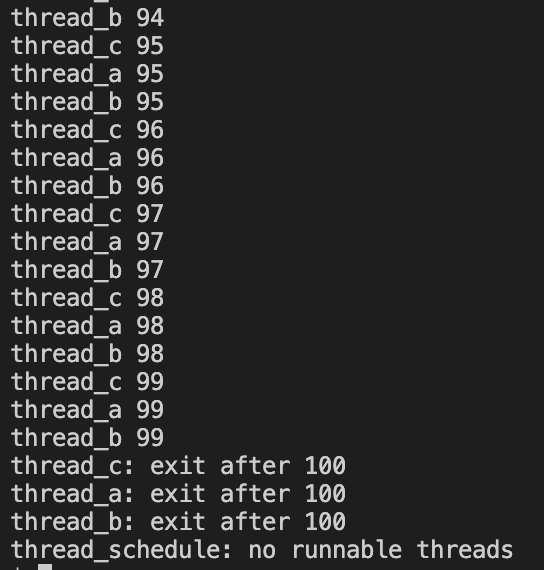
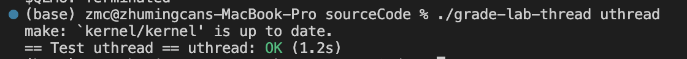
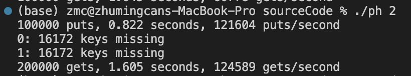
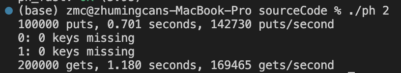
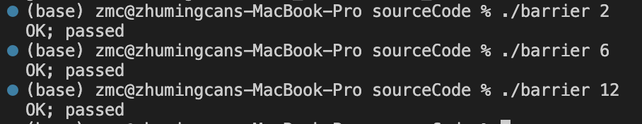
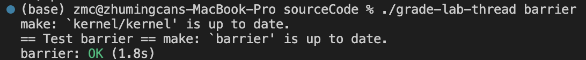

# Lab6: Multithreading
> 2251920
> 朱明灿
## 环境搭建
新建lab6文件夹，重新git clone源码
git checkout thread切换分支
## 实验目的
- ### Uthread: switching between threads
    在用户模式模拟一个进程有多个用户线程，通过 thread_create() 创建线程, thread_schedule() 进行线程调度。
- ### Using threads
    使用互斥锁实现多线程下的数据一致性以及提高并行速度
- ### Barrier
    使用条件变量 pthread_cond_t 配合互斥锁完成多线程同步.
## 实验内容
- ### Uthread: switching between threads
    1. 在uthread.c中定义ctx结构体和源码中的context相同
    2. 在thread结构体定义中添加context成员
    3. 在thread_create函数中添加对线程的执行函数和栈的初始化
    ```
    t->context.ra = (uint64) func;
    t->context.sp = (uint64) t->stack + STACK_SIZE;
    ```
    4. 在thread_schedule函数中添加调用thread_switch函数实现从当前线程在线程数组的位置开始寻找一个 RUNNABLE 状态的线程进行运行。
    5. 在uthread_switch.S中添加thread_switch的代码，和swtch.S的代码一样完成context的保存与恢复
    6. uthread测试如下
    
    7. grade测试如下
    
- ### Using threads
    1. 在ph.c中定义互斥锁数组locks，每个bucket配一个锁避免全部串行
    2. 在main中初始化锁数组
    3. 由于put函数在多线程执行时后执行线程会覆盖先执行线程的数据，导致数据不一致，所以在写入时加互斥锁
    4. get函数只是读操作所以无需互斥锁
    5. NBUCKET数量的增加有利于减少线程间冲突的概率
    6. 修改前测试结果如下
    
    修改后测试结果如下
    
    可见加锁后没有数据丢失
- ### Barrier
    1. 在barrier.c中，给barrier函数添加代码实现，核心是
        ```
        if(++bstate.nthread != nthread)  {    // not all threads reach    
            pthread_cond_wait(&bstate.barrier_cond,&bstate.barrier_mutex);
        } else {  // all threads reach
            bstate.nthread = 0; // reset nthread
            ++bstate.round; // increase round
            pthread_cond_broadcast(&bstate.barrier_cond);
        }
        ```
        每个线程执行到这个函数时判断是否所有线程都到达这里了，是则唤醒所有线程进行同步，否则休眠该线程等待所有线程到达
    2. barrier测试如下
    
    grade测试如下
    
## 实验心得
通过完成 Lab6 中的 Multithreading 实验，我深入探索了多线程编程的重要性和实践操作系统中线程调度、同步和互斥的机制。在本次实验中，我主要学习了 Uthread 的实现、多线程数据一致性的保证以及使用条件变量和互斥锁实现 Barrier 同步的方法。

首先，在实现 Uthread 部分时，我对用户级线程的创建、调度和切换有了更深入的理解。通过定义线程结构体、初始化线程栈和上下文，以及实现线程调度函数，我成功地模拟了用户线程的切换过程，并通过测试验证了其正确性。

在处理多线程数据一致性的问题时，我学会了如何使用互斥锁来避免多线程写操作时的数据覆盖问题。通过在关键代码段加锁，我成功地保证了数据的一致性，并在测试结果中观察到了明显的改善。