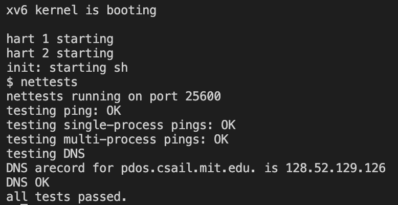
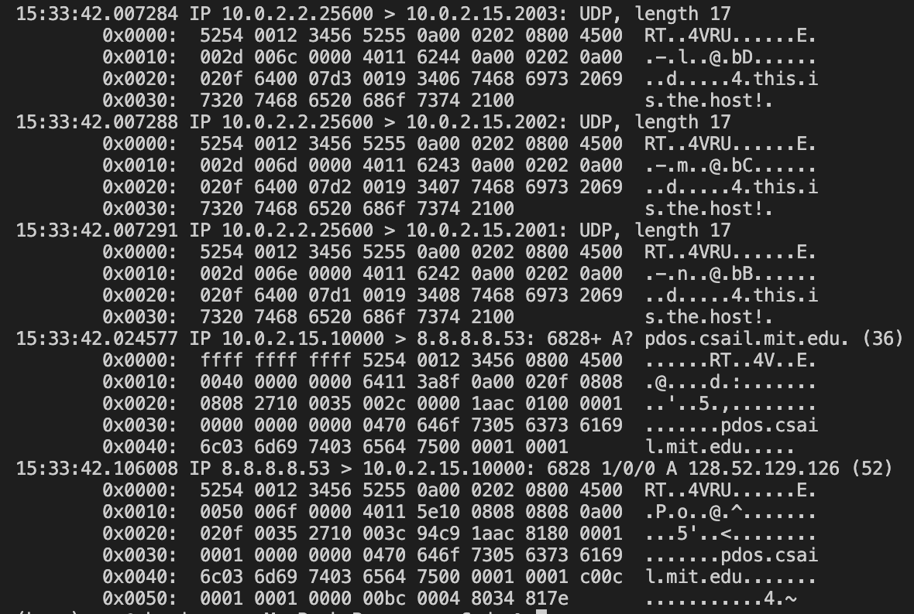
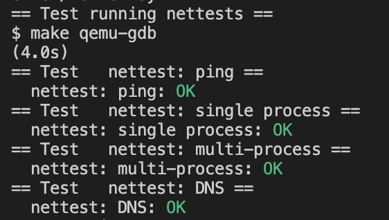

# Lab7: networking
> 2251920
> 朱明灿
## 环境搭建
新建lab7文件夹，重新git clone源码
git checkout net切换分支
## 实验目的
实现 kernel/e1000.c中的 e1000_transmit() 和 e1000_recv() 两个函数, 使网卡驱动可以成功发送和接收数据包
## 实验内容
1. 对于e1000_transmit()函数，tail = regs[E1000_TDT]是软件可以开始写入的位置，desc = tx_ring[tail]是发送数据队列的尾指针描述符（通过其是否写入了E1000_TXD_STAT_DD标志位来判断是否溢出）
2. desc的addr指向缓冲区的开头（m->head），length记录帧或缓冲区长度（m->len）
3. 给desc设置标志位E1000_TXD_CMD_EOP 和E1000_TXD_CMD_RS，分别表示数据的结束以及status的有效性
4. 把缓冲区m记录到缓冲区队列tx_mbuf中
5. 更新尾指针
***
6. 对于e1000_recv() 函数，完成从网卡接收数据到内核的工作。
7. 同上，取得tail和desc，其中尾指针指向的是已被软件处理的数据帧, 其下一个才是当前需要处理的数据帧。判断E1000_RXD_STAT_DD 标志位并进行解封装
8. 调用net_rx(rx_mbufs[tail])让网络栈解封装，调用mbufalloc分配缓冲区存入rx_mbufs[tail]进行替换，并更新desc的addr和status
9. tail指向下一个帧，循环进行解封装
10. 退出循环后更新尾指针
11. make server启动服务端，新建终端测试nettests
    
    查看报文
    
    grade测试结果如下
    
## 问题的发现与解决
1. 两个函数的发送与接收循环队列的尾指针含义不同，发送队列的尾指针代表软件负责的第一个位置，而接收队列的尾指针是指向已经被软件处理过的最后一个位置，所以需要找下一个位置才是需要解封装处理的位置。
2. 在e1000_transmit()中，指令的乱序可能导致尾指针的更新在描述符更新之前，可以使用__sync_synchronize()设置内存屏障来保障内存的正确访问顺序
## 实验心得
1. 在实验过程中，我学到了许多关于网络数据包处理的细节，比如在 e1000_transmit() 函数中，要注意正确设置描述符的地址、长度和控制字段，以及更新尾指针确保数据包被正确发送。而在 e1000_recv() 函数中，要处理好接收数据的解封装和缓冲区的管理，以确保数据的正确接收和处理。
2. 我还遇到了一些问题，比如在处理指令的乱序时可能导致尾指针更新的顺序问题，为了解决这个问题，我学会了使用 __sync_synchronize() 设置内存屏障来保证内存访问的正确顺序，这对于程序的正确性至关重要。