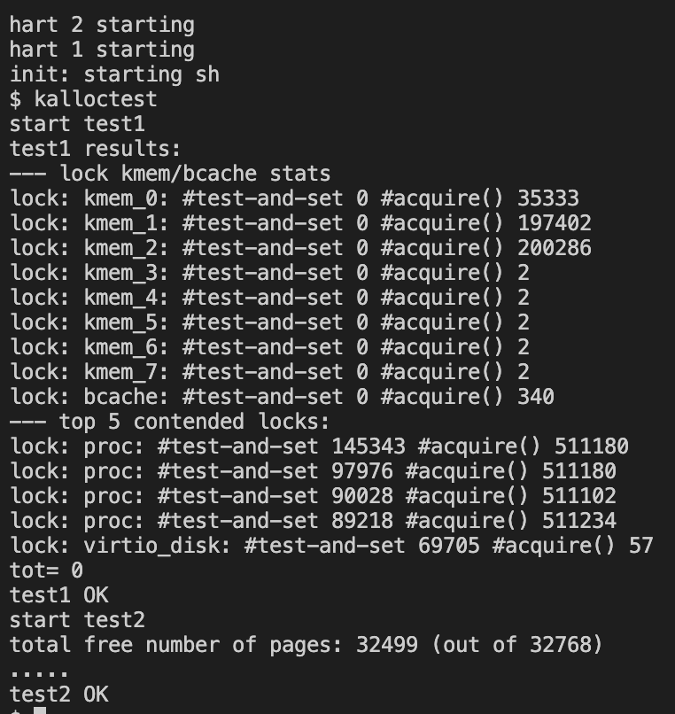
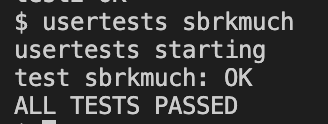
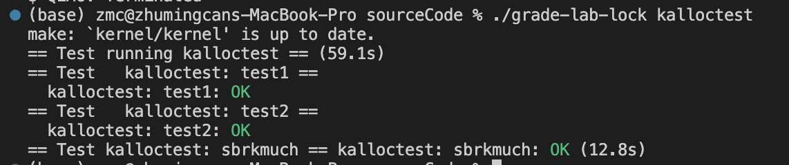
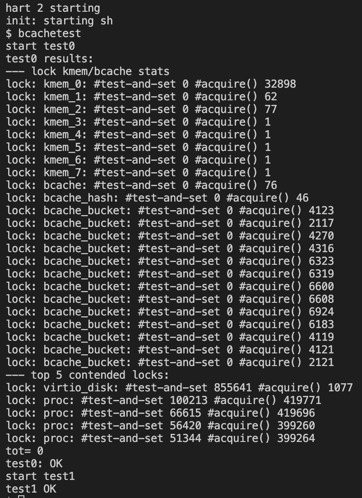
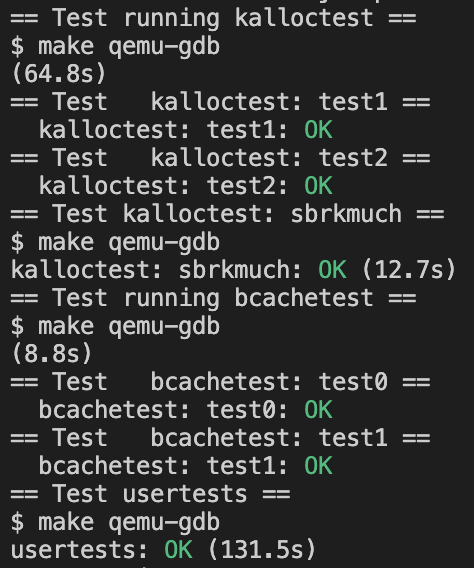

# Lab8: locks
> 2251920
> 朱明灿
## 环境搭建
新建lab8文件夹，重新git clone源码
git checkout lock切换分支
## 实验目的
重新设计内存分配器, 避免使用单个锁和单个空闲内存页链表, 以达到减轻所争用
## 实验内容
- ### Memory allocator
    1. kalloctest测试显示acquire()被调用了很多次，而且kmem锁也被请求了很多次
    2. 修改kmem结构体改为一个内存页数组
    3. 修改kinit函数，对kmems数组初始化
    4. 修改kfree函数，使用 cpuid() 函数获取当前 CPU 核心的序号, 使用 kmems 中对应的锁和 freelist 进行回收
    5. 修改kalloc函数，调用 cpuid() 获取当前 CPU 核心的序号, 使用 kmems 中对应的锁和 freelist 进行物理页的分配.
    6. 编写steal函数，依次遍历剩余的 CPU 的空闲物理页链表找到一个链表不为空的，偷取目标 CPU 一半的空闲物理页
    7. kalloctest和usertests-sbrkmuch测试结果如下
    
    
    可见请求次数显著减少，且自旋锁为0
    8. grade测试如下
    
- ### Buffer cache
    1. 修改buf和bcache的结构体。buf不再使用双向链表而采用哈希表，添加了 timestamp 字段用于记录最后使用缓存块的时间。
    bcache添加了 size 字段, 用于记录已经分配到哈希表的缓存块 struct buf 的数量；添加了 buckets[NBUCKET] 数组, 作为哈希表的 bucket 数组, 其中 NBUCKET 为 bucket 的数目；添加 locks[NBUCKET] 字段, 用于作为每个 bucket 对应的锁; 添加了 hashlock 字段, 作为哈希表的全局锁
    2. 修改binit函数，对新增的字段、锁进行初始化
    3. 修改brelse函数，基于时间戳实现LRU
    4. 修改 bpin() 和 bunpin() 函数，将原本的全局锁替换为缓存块对应的 bucket 的锁
    5. 修改bget函数
    首先是根据 blockno 在哈希表相应 bucket 的链表中寻找对应的缓存块
    若未在哈希表 bucket 中找到, 则先考虑进行缓存块的分配，进行缓存块的初始化操作后, 再将缓存块插入到对应的哈希表 bucket 中
    最后若缓存块已经全部分配出去了, 则根据时间戳找寻缓存块进行重用
    最后考虑对整个过程中加锁，包括遍历bucket时、读取bcache的字段时等
    6. bcachetest测试结果如下
    
    make grade测试结果如下
    
    可见acquire() 整体次数大幅减少，自旋尝试获取锁的次数均为 0 
## 问题的发现与解决
在目标 bucket 找到可重用的缓存块时这里笔者错误地在 bucket 中移除了缓存块, 而此处不应该移除, 否则会导致缓存块的丢失.
## 实验心得
1. 在实验中，我对内存分配器进行了重新设计，将原本使用单个锁和单个空闲内存页链表的结构改为使用一个内存页数组。这样的设计使得在内存分配和释放过程中能够更有效地减少锁的争用，提高系统的并发性能。同时，通过使用不同CPU核心对应的锁和freelist进行内存的回收和分配，我成功地减少了自旋锁的次数，提高了系统的整体性能。
2. 另外，在对缓存块进行管理时，我对buf和bcache的结构进行了修改，引入了哈希表和时间戳等概念。通过使用哈希表和时间戳实现LRU（最近最少使用）策略，我成功地优化了缓存块的管理和利用，减少了对全局锁的争用，提高了系统的并发性能。