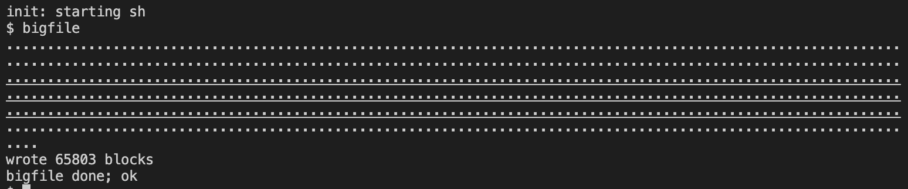
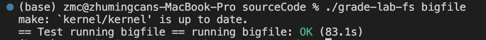
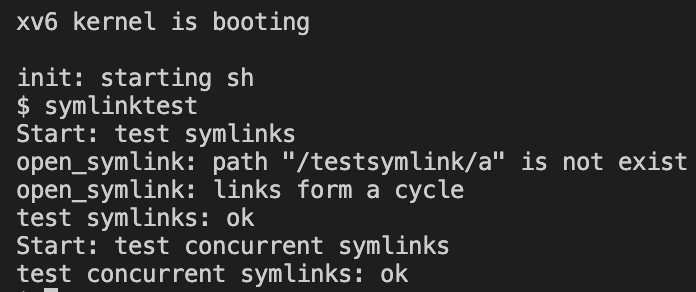
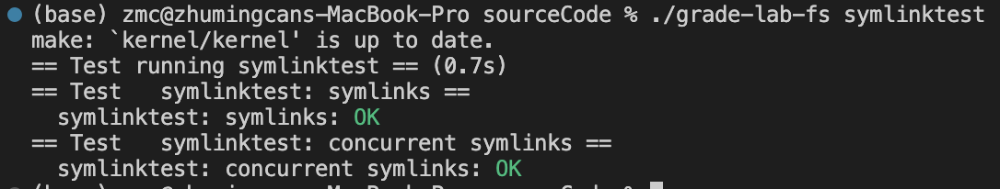

# Lab 9: file system
> 2251920
> 朱明灿
## 环境搭建
新建lab9文件夹，重新git clone源码
git checkout fs切换分支
## 实验目的
- ### Large files
    实现二级间接块索引，ip->addrs[] 的前 11 个元素是直接块(direct block), 第 12 个元素是一个一级间接块索引，第 13 个元素是一个二级间接块索引
- ### Symbolic links
    添加符号链接(软链接)的系统调用 symlink, 修改 open 系统调用处理符号链接的情况, 且符号链接的目标文件仍是符号链接文件时需要递归查找目标文件

## 实验内容
- ### Large files
    1. 修改fs.h中的直接块号的宏定义 NDIRECT 为 11
    2. 修改 inode 相关结构体的块号数组，addrs 字段数组大小设置为 NDIRECT+2
    3. 添加宏定义 NDOUBLYINDIRECT
    ```#define NDOUBLYINDIRECT (NINDIRECT * NINDIRECT)```
    4. 修改fs.c中的 bmap() 函数，添加对第 NDIRECT 即 13 个块的二级间接索引的处理代码，返回 inode 的相对块号对应的磁盘中的块号
    5. 修改fs.c中的 itrunc() 函数，由于添加了二级间接块的结构, 因此也需要添加对该部分的块的释放的代码，两重循环去分别遍历二级间接块以及其中的一级间接块
    6. 修改fs.h中的文件最大大小的宏定义 MAXFILE
    ```#define MAXFILE (NDIRECT + NINDIRECT + NDOUBLYINDIRECT)```
    7. bigfile测试如下
    
    grade测试如下
    
- ### Symbolic links
    1. 添加symlink调用的相关声明定义
    2. 在sysfile.c 中实现 sys_symlink() 函数，首先通过 create() 创建符号链接路径对应的 inode 结构，然后再通过 writei() 将链接的目标文件的路径写入 inode (的 block)中即可.
    3. 编写一个独立的函数 follow_symlink() 用来寻找符号链接的目标文件。首先创建一个大小为 NSYMLINK 的数组 inums[] 用于记录每次跟踪到的文件的 inode number，每次跟踪到目标文件的 inode 后都会将其 inode number 与 inums 数组中记录的进行比较, 若有重复则证明成环.
    简单来说就是至多循环 NSYMLINK 次去递归的跟踪符号链接: 使用 readi() 函数读出符号链接文件中记录的目标文件的路径, 然后使用 namei() 获取文件路径对应的 inode, 然后与已经记录的 inode number 比较判断是否成环. 直到目标 inode 的类型不为 T_SYMLINK 即符号链接类型.
    4. 修改 sysfile.c 的 sys_open() 函数，增加一段代码用于处理。在创建文件对象 f=filealloc() 之前, 对于符号链接, 在非 NO_FOLLOW 的情况下需要将当前文件的 inode 替换为由 follow_symlink() 得到的目标文件的 inode 再进行后续的操作
    5. 在makefile中添加对symlinktest的编译
    6. symlinktest测试如下
    
    grade测试如下
    
## 问题的发现与解决
- ### Large files
    usertests测试时报错panic：virtio_disk_intr status，查找资料后发现需要将NDIRECT修改为11
- ### Symbolic links
    symlinktest测试时报错成环导致无法打开1文件，原因是判断成环的代码用的是指针比较，而内存中inode释放后会被复用，所以会导致明明没有成环却判断为环，需要修改为inode number（ip->inums）比较，该值是inode唯一的编号
## 实验心得
通过这次实验，我深入了解了文件系统中大文件处理和符号链接的实现原理和机制。在解决问题的过程中，我不仅学会了如何修改系统代码以满足新的需求，还提高了对文件系统底层运行机制的理解。这次实验让我对操作系统和文件系统的工作方式有了更深入的认识，也提升了我的问题解决能力和编程技能。这将对我的计算机系统和软件开发能力有着积极的影响。